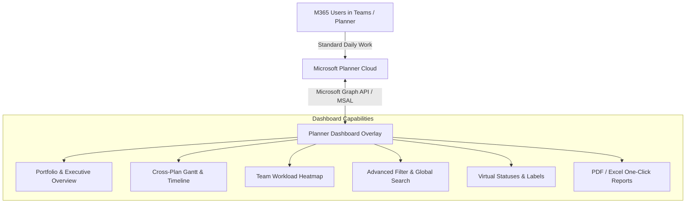

# Microsoft Planner Overlay Dashboard: Feature Feasibility & Benchmark Matrix

## 1. Executive Summary & Core Concept

### The Vision
- **In-Place Architecture**: Microsoft Planner remains the **single source of truth**. Team members keep updating their tasks in Planner / Microsoft Teams without learning a new tool or migrating data.
- **Overlay Dashboard**: A modern, high-performance web dashboard that queries the Microsoft Graph API, aggregates tasks across multiple plans/tenants/groups, and provides enterprise PM capabilities that native Planner lacks.
- **Bi-directional Capability**: Reading is transparent; updating tasks in the dashboard instantly writes back to Microsoft Planner (via Graph API `PATCH /planner/tasks/{id}`).

---

## 2. Feature Benchmark: Asana / Monday.com vs. Native Planner vs. Custom Dashboard

| Feature Domain | Monday.com / Asana | Native MS Planner (Basic) | What We Can Reasonably Build on MS Planner | Technical Approach & Constraints |
| :--- | :--- | :--- | :--- | :--- |
| **Portfolio / Multi-Plan Aggregation** | Native (Portfolios, Enterprise Dashboards) | ❌ Isolated per Plan/Group (No true cross-plan rollup) | ⭐️ **Fully Feasible (High Value)** Single unified view across dozens of plans, buckets, and M365 groups. | Call Graph API `/me/planner/plans` or list group plans, fetch tasks in batch, and aggregate client-side or via a sync cache. |
| **Gantt Chart & Timeline** | Native, interactive drag-and-drop, baseline tracking | ❌ None (Only available in paid Planner Plan 1 / Project on the web) | ⭐️ **Fully Feasible** Interactive Timeline / Gantt view with start date, due date, progress bars. | Planner tasks support `startDateTime` and `dueDateTime`. We can render an interactive SVG/Canvas Gantt chart (e.g. Frappe Gantt or DHTMLX / custom). |
| **Cross-Plan Workload / Resource Management** | Native capacity planning, hours allocated vs. available | ❌ None (Can only see assigned tasks in "Assigned to me") | ⭐️ **Fully Feasible** Assignee workload heatmap, task counts, overdue items per person across all projects. | Aggregate `assignments` across all loaded plans, group by user Azure AD `userId`/displayName, calculate active workload. |
| **Advanced Filtering & Global Search** | Multi-attribute query builder (AND/OR, regex, assignees, dates) | ⚠️ Very limited (basic filter within a single plan) | ⭐️ **Fully Feasible** Instant fuzzy search across all plans, multi-tag filtering, date range pickers. | Fetch tasks and index them in-memory (e.g., Fuse.js or local indexedDB/sqlite cache) for instantaneous instant search. |
| **Milestones & Critical Path** | Native milestones, critical path highlighting | ❌ None | ⭐️ **Partially Feasible** Visual milestones and goal tracking. | Planner tasks can be marked with a specific label (category) or checklist item to represent milestones. |
| **Task Dependencies (Finish-to-Start)** | Native strict blocking/blocked-by relationships | ❌ None in Basic Planner | ⚠️ **Simulated / Virtual Dependencies** Store dependency links in dashboard metadata or task notes/checklist, showing visual links on Gantt. | Native Planner basic API does not have a `dependency` field. We can either store relationships in an external metadata store (or task description tags like `[blocks: task_id]`). |
| **Custom Fields & Custom Columns** | Arbitrary text, numbers, formulas, dropdowns, status pills | ❌ Fixed schema (Title, Bucket, Dates, Priority, PercentComplete, Notes, Checklist, Labels 1-25) | ⚠️ **Hybrid Metadata** Map custom fields into: 1) Color Categories (up to 25 labels), 2) Structured JSON in task `details.description`, or 3) Lightweight companion DB. | Best lightweight approach: Use Planner's 25 named color labels (`category1`–`category25`), plus structured metadata tags in Task Notes. |
| **Analytics & Executive KPIs** | Burndown charts, cycle time, velocity, custom widgets | ⚠️ Basic ring chart (Not started, In progress, Late, Completed) | ⭐️ **Fully Feasible** SLA tracking, completion velocity, overdue risk matrix, plan health scores. | Compute dynamic metrics from `createdDateTime`, `completedDateTime`, `dueDateTime`, and `percentComplete`. |
| **Kanban Board (Custom Grouping)** | Group by any column (Status, Assignee, Priority, Phase) | ⚠️ Only groups by Bucket, Assigned To, Progress, Due Date, Priority, Labels | ⭐️ **Fully Feasible** Flexible virtual columns, swimlanes (e.g. swimlane by Project, column by Status). | Re-group task objects in frontend state on the fly. Dragging cards across columns translates to updating the corresponding Planner property. |
| **Time Tracking / Estimates** | Native hours logged, estimated vs. actual | ❌ None | ⚠️ **Feasible via Task Notes or Companion DB** Log spent hours and estimates. | Can store `est: 4h | spent: 2.5h` in task notes or local database and display budget progress bars. |
| **Automations & Webhooks** | No-code automations ("When status changes to X, notify Y") | ⚠️ Requires Power Automate | ⭐️ **Feasible** Power Automate integration or Graph Change Notifications (Webhooks / Delta query). | Listen to Graph delta queries (`/planner/tasks/delta`) or sync periodically to trigger alerts and status changes. |
| **Exporting & Reporting (PDF/Excel)** | Scheduled reports, CSV, PDF snapshots | ⚠️ Excel export is basic and single-plan only | ⭐️ **Fully Feasible** One-click PDF executive summary, multi-plan Excel/CSV export, sprint reports. | Read aggregated in-memory tasks and format with SheetJS (`xlsx`) and jsPDF. |

---

## 3. Key Technical Insights on Microsoft Graph Planner API

### Strengths We Can Leverage
1. **ETag Concurrency Control**: Planner API enforces optimistic concurrency with `@odata.etag`. Updates are safe and prevent overwriting collisions.
2. **Standard M365 Auth (Entra ID)**: Users log in with their existing work/school account via MSAL (Microsoft Authentication Library). Zero separate credential management.
3. **Labels / Applied Categories**: Planner supports 25 colored categories (`category1` to `category25`) with custom descriptions per plan. These can serve as custom status flags or tags.
4. **Checklists & Rich Notes**: We can inspect and toggle subtask checklist items right from the dashboard without opening Planner.

### Real Constraints to Design Around
1. **Graph API Throttling & Rate Limits**:
   - Calling `/planner/plans/{id}/tasks` for 50 plans sequentially can trigger HTTP 429 (Too Many Requests).
   - **Solution**: Implement concurrent batching (`$batch` endpoint), local caching (IndexedDB or lightweight SQLite/Redis cache), and delta queries.
2. **Fixed Task Schema**:
   - You cannot add arbitrary SQL-like columns to Microsoft's underlying Planner database.
   - **Solution**: Use task description metadata comments (`<!-- meta: {"budget": 5000, "phase": "Design"} -->`) or an overlay database keyed by `plannerTaskId`.

---

## 4. Recommended System Architecture

---

## 5. Phased Delivery Roadmap

### Phase 1: Core Read & Aggregation (MVP)
- Microsoft Entra ID Authentication (MSAL).
- Multi-Plan Selector & Aggregator (fetches all accessible plans).
- Global Kanban board (group by Assignee, Priority, Bucket, or Plan).
- Global Search & Multi-Tag Filtering.
- Health KPI cards (Overdue rate, Velocity, Completion %).

### Phase 2: Visual PM Tools (Asana / Monday parity)
- Interactive Timeline / Gantt Chart view (drag dates, resize durations).
- Workload / Capacity View (who is overloaded across all projects).
- Inline Task Editing (status, priority, due date, checklist toggle with ETag updates).
- Export to Excel and PDF Executive Summary.

### Phase 3: Power Features
- Simulated Task Dependencies & Critical Path.
- Real-time sync via Microsoft Graph Delta Queries.
- Custom metadata storage (Time tracking, custom tags).
